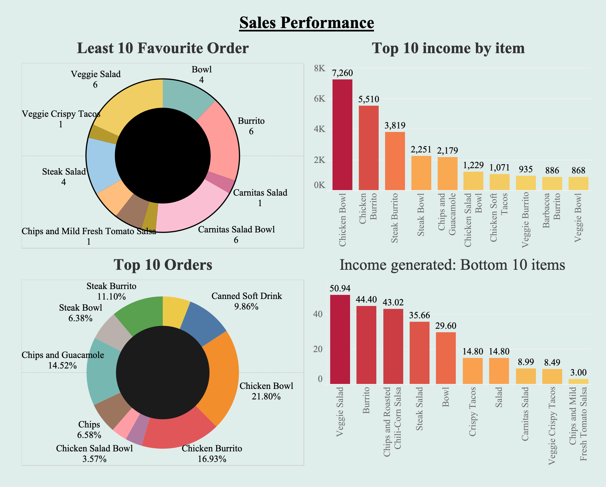

# Get to know about DATA CLEANING

This repository contains code for analyzing and cleaning a dataset from Chipotle. The dataset contains information about orders from Chipotle, including the items ordered, quantity, and price.

# Data Source
The data for this analysis was taken from [justmarkham/DAT8](https://github.com/justmarkham/DAT8/blob/master/data/chipotle.tsv), which contains a TSV file of Chipotle orders.

# Data Analysis

The python code is mainly responsible for the following analyses:
- Reads in the Chipotle orders data from a local file 
- Cleans the item_price column by removing the dollar sign and converting the datatype from object to float64
- Identifies the missing values and replaces them with 'Regular Order' for the choice_description column 
- Removes the duplicate rows from the dataset 
- Export the cleaned data

# Data Visualization using Tableau

